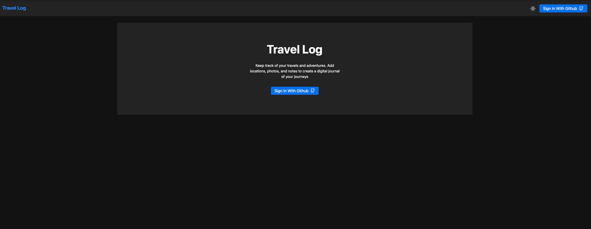
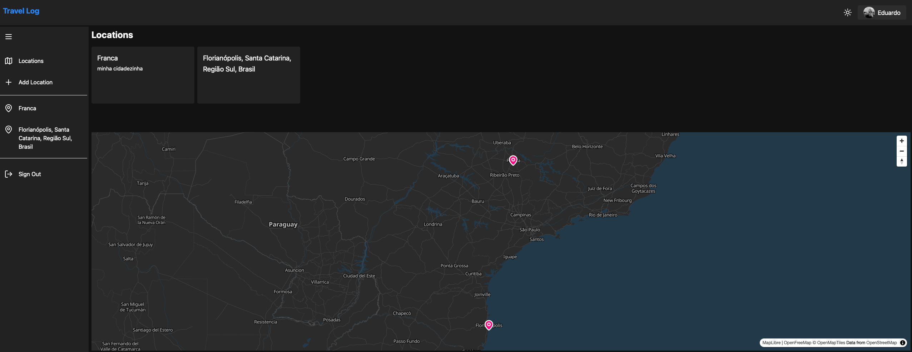
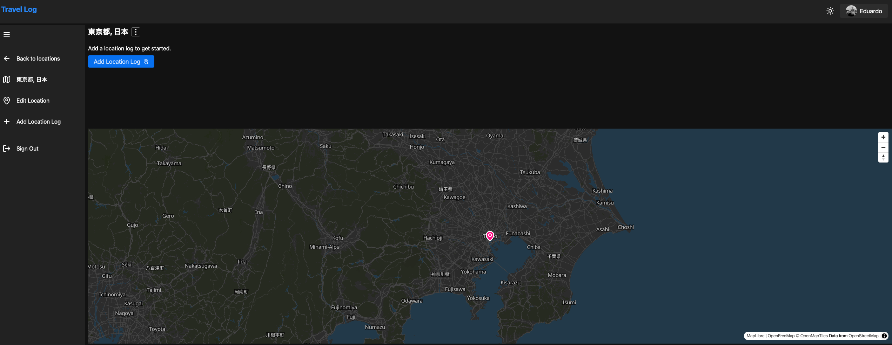
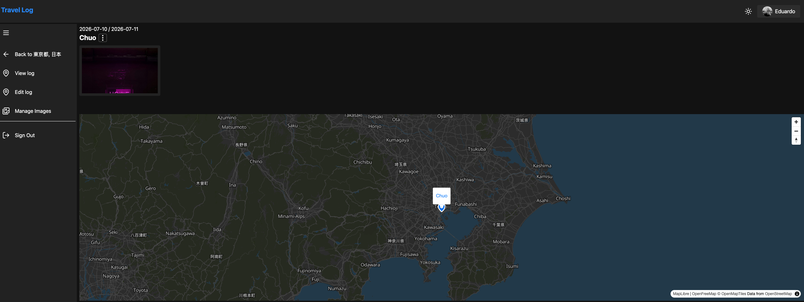

# SvelteKit Travel Log

🇧🇷 Leia em português: [README.pt-BR.md](README.pt-BR.md)

A full-stack travel journal. Add the places you've visited on an interactive map, log trips to each one with dates and notes, and attach photos to every log entry.

This is a SvelteKit adaptation of the "Travel Log" project taught by CJ on [Syntax](https://syntax.fm/) — see [Credits](#credits) below. The original is built with Nuxt; this repo reimplements the same product with SvelteKit, better-auth, Drizzle/Turso, and SeaweedFS for image storage.

## Table of contents

- [Screenshots](#screenshots)
- [Features](#features)
- [Tech stack](#tech-stack)
- [Project structure](#project-structure)
- [Getting started](#getting-started)
  - [Prerequisites](#prerequisites)
  - [1. Clone and install](#1-clone-and-install)
  - [2. Environment variables](#2-environment-variables)
  - [3. Database](#3-database)
  - [4. Image storage (SeaweedFS via Docker Compose)](#4-image-storage-seaweedfs-via-docker-compose)
  - [5. Run the app](#5-run-the-app)
- [Available scripts](#available-scripts)
- [Database & migrations](#database--migrations)
- [Authentication](#authentication)
- [Building for production](#building-for-production)
- [Credits](#credits)

## Screenshots

> Add your own screenshots/videos to [`docs/media`](docs/media) and they'll show up here.

**Home / sign-in**



**Dashboard & map**



**Add a location**

<video src="docs/media/add-location.mp4" controls width="100%"></video>

**Location detail**



**Add a log entry**

<video src="docs/media/add-log.mp4" controls width="100%"></video>

**Image gallery**



**Uploading images**

<video src="docs/media/image-upload.mp4" controls width="100%"></video>

## Features

- Interactive map (MapLibre GL) for browsing and adding locations
- Add locations by dragging a marker or searching an address via Nominatim (OpenStreetMap)
- Log individual trips per location, with start/end dates and notes
- Upload, view, and delete photos on a log entry, with a lightbox gallery (PhotoSwipe)
- GitHub OAuth sign-in via better-auth

## Tech stack

| Layer                | Choice                                                                                                          |
| -------------------- | --------------------------------------------------------------------------------------------------------------- |
| Framework            | [SvelteKit](https://svelte.dev/docs/kit) (Svelte 5, runes)                                                      |
| Auth                 | [better-auth](https://www.better-auth.com/) — GitHub OAuth                                                      |
| Database             | [Turso](https://turso.tech/) (libSQL/SQLite) + [Drizzle ORM](https://orm.drizzle.team/)                         |
| Validation           | [valibot](https://valibot.dev/) + [TanStack Form](https://tanstack.com/form)                                    |
| Maps                 | [MapLibre GL](https://maplibre.org/) + [svelte-maplibre-gl](https://github.com/mapaddon/svelte-maplibre-gl)     |
| Client data fetching | [TanStack Query](https://tanstack.com/query) + [ky](https://github.com/sindresorhus/ky)                         |
| UI                   | [Skeleton UI](https://www.skeleton.dev/) + [Tailwind CSS v4](https://tailwindcss.com/)                          |
| Image storage        | [SeaweedFS](https://github.com/seaweedfs/seaweedfs) (S3-compatible), via `@aws-sdk/client-s3` presigned uploads |
| Image gallery        | [PhotoSwipe](https://photoswipe.com/)                                                                           |

## Project structure

```
src/
├── lib/
│   ├── schema/            # Drizzle table definitions + valibot insert/select schemas
│   ├── server/
│   │   ├── db/            # DB client + Drizzle migrations
│   │   └── utils/          # Result type, auth request handler, etc.
│   └── auth-client.ts      # Client-side better-auth helper
└── routes/
    ├── dashboard/          # Location list + map, add/edit location, location detail
    ├── api/
    │   ├── locations/      # REST endpoints for locations and their logs/images
    │   └── search/         # Nominatim geocoder proxy
    └── sign-out/
```

See [`CLAUDE.md`](CLAUDE.md) for a deeper architectural walkthrough (auth flow, state management, routing).

## Getting started

### Prerequisites

- [Node.js](https://nodejs.org/) 20+
- [pnpm](https://pnpm.io/) 9+ (`corepack enable` will pick up the version pinned in `package.json`)
- [Docker](https://www.docker.com/) (for the SeaweedFS image storage container)
- [Turso CLI](https://docs.turso.tech/cli/installation) (`turso dev` powers the local database — installed as part of `pnpm install`/available via `pnpm dev:db`)
- A [GitHub OAuth App](https://github.com/settings/developers) for sign-in (callback URL: `http://localhost:5173/api/auth/callback/github` for local dev)

### 1. Clone and install

```bash
git clone <this-repo-url>
cd sveltekit-travel-log
pnpm install
```

### 2. Environment variables

Copy the example file and fill in the values:

```bash
cp .env.example .env
```

| Variable                                    | Purpose                                                          |
| ------------------------------------------- | ---------------------------------------------------------------- |
| `NODE_ENV`                                  | `development` locally                                            |
| `TURSO_DATABASE_URL`                        | `http://127.0.0.1:8080` for local dev                            |
| `TURSO_AUTH_TOKEN`                          | Leave empty for local dev                                        |
| `BETTER_AUTH_SECRET`                        | Random secret used by better-auth (e.g. `openssl rand -hex 32`)  |
| `BETTER_AUTH_URL`                           | `http://localhost:5173` for local dev                            |
| `GITHUB_CLIENT_ID` / `GITHUB_CLIENT_SECRET` | Credentials from your GitHub OAuth App                           |
| `VERCEL_URL`                                | Deployed domain in production (used to build absolute auth URLs) |
| `S3_ENDPOINT`                               | SeaweedFS S3 gateway, `http://127.0.0.1:8333` locally            |
| `S3_ACCESS_KEY` / `S3_SECRET_KEY`           | Created in the SeaweedFS admin UI (see below)                    |
| `S3_REGION`                                 | Any value SeaweedFS accepts, e.g. `us-east-1`                    |
| `S3_BUCKET`                                 | Bucket name created in the SeaweedFS admin UI                    |
| `PUBLIC_S3_BUCKET_URL`                      | Public base URL used to render uploaded images                   |

### 3. Database

Local development uses `turso dev` to run a local SQLite-compatible server (no Turso cloud account needed). It's started automatically by `pnpm dev`, or on its own with:

```bash
pnpm dev:db
```

Apply migrations against it:

```bash
pnpm db:migrate
```

### 4. Image storage (SeaweedFS via Docker Compose)

Location log photos are uploaded straight from the browser to an S3-compatible bucket via presigned URLs. Locally, that bucket is provided by [SeaweedFS](https://github.com/seaweedfs/seaweedfs) running in Docker.

1. Start the containers:

   ```bash
   docker compose up -d
   ```

   This brings up two services (see `docker-compose.yml`):
   - `seaweedfs` — the master/volume/filer/S3 server, exposing the S3 API on `:8333`
   - `seaweedfs-admin` — a web admin UI on `:23646` for managing buckets and S3 credentials

2. Open the admin UI at [http://localhost:23646/object-store/users](http://localhost:23646/object-store/users) and create a user with an access key and secret key.

3. Still in the admin UI, create a bucket (this is the value you'll use for `S3_BUCKET`).

4. Fill in `.env` with the values from steps 2–3:

   ```
   S3_ENDPOINT=http://127.0.0.1:8333
   S3_ACCESS_KEY=<access key from step 2>
   S3_SECRET_KEY=<secret key from step 2>
   S3_REGION=us-east-1
   S3_BUCKET=<bucket name from step 3>
   PUBLIC_S3_BUCKET_URL=http://127.0.0.1:8333/<bucket name from step 3>
   ```

Data is persisted to `./seaweedfs/data` on the host, so containers can be stopped/restarted without losing uploaded images. To tear everything down:

```bash
docker compose down
```

### 5. Run the app

```bash
pnpm dev
```

This starts `turso dev` and the Vite dev server concurrently, available at `http://localhost:5173`.

## Available scripts

| Command                           | Description                                         |
| --------------------------------- | --------------------------------------------------- |
| `pnpm dev`                        | Run the local Turso DB and Vite dev server together |
| `pnpm dev:db`                     | Run only the local Turso SQLite server              |
| `pnpm check` / `pnpm check:watch` | Type-check the project with `svelte-check`          |
| `pnpm lint` / `pnpm lint:fix`     | Lint (and auto-fix) with ESLint                     |
| `pnpm db:generate`                | Generate Drizzle migrations from schema changes     |
| `pnpm db:migrate`                 | Apply pending migrations                            |
| `pnpm db:studio`                  | Open Drizzle Studio against the configured database |
| `pnpm build`                      | Build for production                                |
| `pnpm preview`                    | Preview the production build locally                |

There are no automated tests in this project — `pnpm check` is the main correctness gate.

## Database & migrations

Schemas live in `src/lib/schema/` and double as the source of truth for both the Drizzle table definitions and the valibot validation schemas (via `drizzle-valibot`). The core tables:

- **`location`** — a place the user has added (name, slug, description, lat/long)
- **`locationLog`** — a logged visit to a location (name, description, start/end dates)
- **`locationLogImage`** — a photo attached to a log entry (S3 object key, width, height)

Migrations are generated with `drizzle-kit` from these schema files and stored under `src/lib/server/db/migrations/`. After changing a schema file, run:

```bash
pnpm db:generate   # writes a new migration file
pnpm db:migrate    # applies it to the database configured in .env
```

`drizzle.config.ts` points `drizzle-kit` at the schema files and the Turso connection from your environment variables.

## Authentication

Auth is handled by [better-auth](https://www.better-auth.com/) with GitHub as the only OAuth provider. `hooks.server.ts` resolves the session on every request, attaches it to `event.locals.session`, and redirects unauthenticated requests away from `/dashboard/**`. All API route handlers are wrapped with an `AuthenticatedRequestHandler` that returns `401` when there's no session.

## Building for production

```bash
pnpm build
pnpm preview   # sanity-check the build locally
```

The project uses `@sveltejs/adapter-node`, so the build output in `build/` is a standalone Node server (`node build`) — deploy it behind any Node-capable host, pointing it at your production Turso database and S3-compatible bucket.

## Credits

This project is a SvelteKit adaptation of the Travel Log app built by [CJ](https://github.com/w3cj) on [Syntax](https://syntax.fm/):

- 📺 Original video: [Build a Full Stack App with Nuxt](https://www.youtube.com/watch?v=DK93dqmJJYg)
- 💻 Original repo (Nuxt): [w3cj/nuxt-travel-log](https://github.com/w3cj/nuxt-travel-log)

The product idea, data model, and general feature set follow the original; the stack, implementation, and architecture here (SvelteKit, better-auth, Drizzle/Turso, SeaweedFS) are this project's own.
