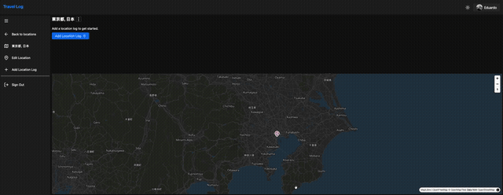
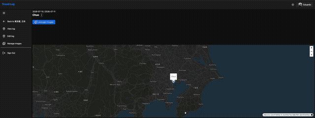

# SvelteKit Travel Log

🇺🇸 Read in English: [README.md](README.md)

Um diário de viagens full-stack. Adicione os lugares que você visitou em um mapa interativo, registre viagens para cada um deles com datas e anotações, e anexe fotos a cada registro.

Este projeto é uma adaptação em SvelteKit do projeto "Travel Log" ensinado pelo CJ no [Syntax](https://syntax.fm/) — veja [Créditos](#créditos) abaixo. O original é feito com Nuxt; este repositório reimplementa o mesmo produto usando SvelteKit, better-auth, Drizzle/Turso e SeaweedFS para armazenamento de imagens.

## Sumário

- [Screenshots](#screenshots)
- [Funcionalidades](#funcionalidades)
- [Stack de tecnologias](#stack-de-tecnologias)
- [Estrutura do projeto](#estrutura-do-projeto)
- [Começando](#começando)
  - [Pré-requisitos](#pré-requisitos)
  - [1. Clonar e instalar](#1-clonar-e-instalar)
  - [2. Variáveis de ambiente](#2-variáveis-de-ambiente)
  - [3. Banco de dados](#3-banco-de-dados)
  - [4. Armazenamento de imagens (SeaweedFS via Docker Compose)](#4-armazenamento-de-imagens-seaweedfs-via-docker-compose)
  - [5. Rodando a aplicação](#5-rodando-a-aplicação)
- [Scripts disponíveis](#scripts-disponíveis)
- [Banco de dados & migrations](#banco-de-dados--migrations)
- [Autenticação](#autenticação)
- [Build para produção](#build-para-produção)
- [Créditos](#créditos)

## Screenshots

> Adicione seus próprios screenshots/vídeos em [`docs/media`](docs/media) e eles vão aparecer aqui.

**Página inicial**


**Dashboard & mapa**


**Adicionar localização**


**Detalhe da localização**


**Adicionar registro**



**Galeria de imagens**


**Upload de imagens**



## Funcionalidades

- Mapa interativo (MapLibre GL) para navegar e adicionar localizações
- Adição de localizações arrastando um marcador ou buscando um endereço via Nominatim (OpenStreetMap)
- Registro de viagens individuais por localização, com datas de início/fim e anotações
- Upload, visualização e remoção de fotos em um registro, com galeria em lightbox (PhotoSwipe)
- Login via GitHub OAuth usando better-auth

## Stack de tecnologias

| Camada                   | Escolha                                                                                                                     |
| ------------------------ | --------------------------------------------------------------------------------------------------------------------------- |
| Framework                | [SvelteKit](https://svelte.dev/docs/kit) (Svelte 5, runes)                                                                  |
| Autenticação             | [better-auth](https://www.better-auth.com/) — OAuth do GitHub                                                               |
| Banco de dados           | [Turso](https://turso.tech/) (libSQL/SQLite) + [Drizzle ORM](https://orm.drizzle.team/)                                     |
| Validação                | [valibot](https://valibot.dev/) + [TanStack Form](https://tanstack.com/form)                                                |
| Mapas                    | [MapLibre GL](https://maplibre.org/) + [svelte-maplibre-gl](https://github.com/mapaddon/svelte-maplibre-gl)                 |
| Busca de dados no client | [TanStack Query](https://tanstack.com/query) + [ky](https://github.com/sindresorhus/ky)                                     |
| UI                       | [Skeleton UI](https://www.skeleton.dev/) + [Tailwind CSS v4](https://tailwindcss.com/)                                      |
| Armazenamento de imagens | [SeaweedFS](https://github.com/seaweedfs/seaweedfs) (compatível com S3), via uploads pré-assinados com `@aws-sdk/client-s3` |
| Galeria de imagens       | [PhotoSwipe](https://photoswipe.com/)                                                                                       |

## Estrutura do projeto

```
src/
├── lib/
│   ├── schema/            # Definições de tabelas do Drizzle + schemas valibot de insert/select
│   ├── server/
│   │   ├── db/            # Cliente do banco + migrations do Drizzle
│   │   └── utils/          # Result type, auth request handler, etc.
│   └── auth-client.ts      # Helper client-side do better-auth
└── routes/
    ├── dashboard/          # Lista de localizações + mapa, adicionar/editar localização, detalhe da localização
    ├── api/
    │   ├── locations/      # Endpoints REST para localizações e seus registros/imagens
    │   └── search/         # Proxy do geocoder Nominatim
    └── sign-out/
```

Veja [`CLAUDE.md`](CLAUDE.md) para uma explicação arquitetural mais profunda (fluxo de autenticação, gerenciamento de estado, roteamento) — está em inglês.

## Começando

### Pré-requisitos

- [Node.js](https://nodejs.org/) 20+
- [pnpm](https://pnpm.io/) 9+ (`corepack enable` já detecta a versão fixada em `package.json`)
- [Docker](https://www.docker.com/) (para o container de armazenamento de imagens SeaweedFS)
- [Turso CLI](https://docs.turso.tech/cli/installation) (o `turso dev` roda o banco de dados local — instalado junto com `pnpm install`/disponível via `pnpm dev:db`)
- Um [GitHub OAuth App](https://github.com/settings/developers) para o login (callback URL: `http://localhost:5173/api/auth/callback/github` para desenvolvimento local)

### 1. Clonar e instalar

```bash
git clone <url-deste-repositório>
cd sveltekit-travel-log
pnpm install
```

### 2. Variáveis de ambiente

Copie o arquivo de exemplo e preencha os valores:

```bash
cp .env.example .env
```

| Variável                                    | Finalidade                                                                       |
| ------------------------------------------- | -------------------------------------------------------------------------------- |
| `NODE_ENV`                                  | `development` localmente                                                         |
| `TURSO_DATABASE_URL`                        | `http://127.0.0.1:8080` para desenvolvimento local                               |
| `TURSO_AUTH_TOKEN`                          | Deixe vazio para desenvolvimento local                                           |
| `BETTER_AUTH_SECRET`                        | Segredo aleatório usado pelo better-auth (ex.: `openssl rand -hex 32`)           |
| `BETTER_AUTH_URL`                           | `http://localhost:5173` para desenvolvimento local                               |
| `GITHUB_CLIENT_ID` / `GITHUB_CLIENT_SECRET` | Credenciais do seu GitHub OAuth App                                              |
| `VERCEL_URL`                                | Domínio publicado em produção (usado para montar URLs absolutas de autenticação) |
| `S3_ENDPOINT`                               | Gateway S3 do SeaweedFS, `http://127.0.0.1:8333` localmente                      |
| `S3_ACCESS_KEY` / `S3_SECRET_KEY`           | Criadas na admin UI do SeaweedFS (veja abaixo)                                   |
| `S3_REGION`                                 | Qualquer valor aceito pelo SeaweedFS, ex.: `us-east-1`                           |
| `S3_BUCKET`                                 | Nome do bucket criado na admin UI do SeaweedFS                                   |
| `PUBLIC_S3_BUCKET_URL`                      | URL pública base usada para exibir as imagens enviadas                           |

### 3. Banco de dados

O desenvolvimento local usa o `turso dev` para rodar um servidor local compatível com SQLite (não precisa de conta na nuvem da Turso). Ele é iniciado automaticamente pelo `pnpm dev`, ou isoladamente com:

```bash
pnpm dev:db
```

Aplique as migrations nele:

```bash
pnpm db:migrate
```

### 4. Armazenamento de imagens (SeaweedFS via Docker Compose)

As fotos dos registros de localização são enviadas diretamente do navegador para um bucket compatível com S3 usando URLs pré-assinadas. Localmente, esse bucket é fornecido pelo [SeaweedFS](https://github.com/seaweedfs/seaweedfs) rodando no Docker.

1. Suba os containers:

   ```bash
   docker compose up -d
   ```

   Isso sobe dois serviços (veja `docker-compose.yml`):
   - `seaweedfs` — o servidor master/volume/filer/S3, expondo a API S3 na porta `:8333`
   - `seaweedfs-admin` — uma interface web de administração na porta `:23646` para gerenciar buckets e credenciais S3

2. Abra a admin UI em [http://localhost:23646/object-store/users](http://localhost:23646/object-store/users) e crie um usuário com access key e secret key.

3. Ainda na admin UI, crie um bucket (esse é o valor que você vai usar em `S3_BUCKET`).

4. Preencha o `.env` com os valores dos passos 2–3:

   ```
   S3_ENDPOINT=http://127.0.0.1:8333
   S3_ACCESS_KEY=<access key do passo 2>
   S3_SECRET_KEY=<secret key do passo 2>
   S3_REGION=us-east-1
   S3_BUCKET=<nome do bucket do passo 3>
   PUBLIC_S3_BUCKET_URL=http://127.0.0.1:8333/<nome do bucket do passo 3>
   ```

Os dados ficam persistidos em `./seaweedfs/data` no host, então os containers podem ser parados/reiniciados sem perder as imagens enviadas. Para derrubar tudo:

```bash
docker compose down
```

### 5. Rodando a aplicação

```bash
pnpm dev
```

Isso inicia o `turso dev` e o servidor de desenvolvimento do Vite juntos, disponíveis em `http://localhost:5173`.

## Scripts disponíveis

| Comando                           | Descrição                                                  |
| --------------------------------- | ---------------------------------------------------------- |
| `pnpm dev`                        | Roda o banco Turso local e o servidor Vite juntos          |
| `pnpm dev:db`                     | Roda apenas o servidor Turso SQLite local                  |
| `pnpm check` / `pnpm check:watch` | Checagem de tipos com `svelte-check`                       |
| `pnpm lint` / `pnpm lint:fix`     | Lint (e correção automática) com ESLint                    |
| `pnpm db:generate`                | Gera migrations do Drizzle a partir das mudanças no schema |
| `pnpm db:migrate`                 | Aplica as migrations pendentes                             |
| `pnpm db:studio`                  | Abre o Drizzle Studio conectado ao banco configurado       |
| `pnpm build`                      | Build para produção                                        |
| `pnpm preview`                    | Pré-visualiza o build de produção localmente               |

Não há testes automatizados neste projeto — o `pnpm check` é o principal mecanismo de garantia de corretude.

## Banco de dados & migrations

Os schemas ficam em `src/lib/schema/` e servem como fonte única de verdade tanto para as definições de tabela do Drizzle quanto para os schemas de validação do valibot (via `drizzle-valibot`). As tabelas principais:

- **`location`** — um lugar que o usuário adicionou (nome, slug, descrição, lat/long)
- **`locationLog`** — uma visita registrada a uma localização (nome, descrição, datas de início/fim)
- **`locationLogImage`** — uma foto anexada a um registro (chave do objeto no S3, largura, altura)

As migrations são geradas com `drizzle-kit` a partir desses arquivos de schema e ficam em `src/lib/server/db/migrations/`. Depois de alterar um arquivo de schema, rode:

```bash
pnpm db:generate   # gera um novo arquivo de migration
pnpm db:migrate    # aplica no banco configurado no .env
```

O `drizzle.config.ts` aponta o `drizzle-kit` para os arquivos de schema e para a conexão Turso definida nas variáveis de ambiente.

## Autenticação

A autenticação é feita pelo [better-auth](https://www.better-auth.com/), usando o GitHub como único provedor OAuth. O `hooks.server.ts` resolve a sessão em cada requisição, anexa em `event.locals.session` e redireciona requisições não autenticadas para fora de `/dashboard/**`. Todos os handlers de rotas da API são envolvidos por um `AuthenticatedRequestHandler` que retorna `401` quando não há sessão.

## Build para produção

```bash
pnpm build
pnpm preview   # valide o build localmente
```

O projeto usa o `@sveltejs/adapter-node`, então o resultado do build em `build/` é um servidor Node standalone (`node build`) — faça o deploy dele em qualquer host com suporte a Node, apontando para o banco Turso e o bucket compatível com S3 de produção.

## Créditos

Este projeto é uma adaptação em SvelteKit do app Travel Log construído pelo [CJ](https://github.com/w3cj) no [Syntax](https://syntax.fm/):

- 📺 Vídeo original: [Build a Full Stack App with Nuxt](https://www.youtube.com/watch?v=DK93dqmJJYg)
- 💻 Repositório original (Nuxt): [w3cj/nuxt-travel-log](https://github.com/w3cj/nuxt-travel-log)

A ideia do produto, o modelo de dados e o conjunto geral de funcionalidades seguem o original; a stack, a implementação e a arquitetura aqui (SvelteKit, better-auth, Drizzle/Turso, SeaweedFS) são próprias deste projeto.
